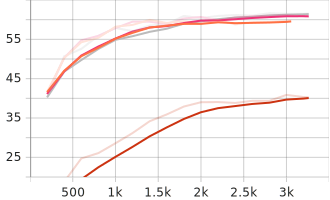
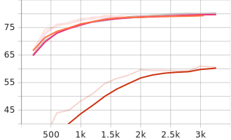

[Main Page](../../README.md)

# TQuad Dataset

[TR] Yarışma kapsamında hazırlanan Türkçe soru-cevap [verisetidir](https://github.com/TQuad/turkish-nlp-qa-dataset).

[EN]

# Fine Tuning Metrics

Model         | Phase       | Exact Match |  F1
:-------------|:------------|:-----------:|:------------:
BERTurk       | Train/Eval  | 59.7178     |  79.4480
          | Test        | 59.4177     |  79.6924
DistilBERTurk | Train/Eval  | 40.2822     |  60.5264
          | Test        | 39.7634     |  59.0327
ConvBERTurk   | Train/Eval  | 60.8102     |  79.6843
          | Test        | 60.6005     |  79.3676
ELECTRA Base  | Train/Eval  | <b>61.5385  |  <b>80.3351
          | Test        | <b>61.2375  |  <b>80.7814

 
 

# Fine Tuning Metrics by Step
 BERTurk
-~- 
 DistilBERTurk
-~- 
 ConvBERTurk
-~- 
  ELECTRA Base

BERTurk -~- 
DistilBERTurk -~- 
ConvBERTurk -~- 
ELECTRA Base

Exact Match                |  F1
:-------------------------:|:-------------------------:
  |  