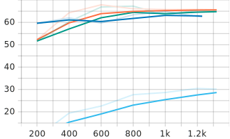
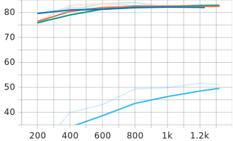

[Main Page](../../README.md)

# YTU Dataset

[TR] [Prof.Dr. Banu DİRİ](https://avesis.yildiz.edu.tr/diri) tarafından hazırlanan soru-cevap verisetidir. İlgili verisetine ulaşmak için kendisi ile iletişime geçiniz.

[EN] 

# Fine Tuning Metrics

Model         | Phase       | Exact Match |  F1
:-------------|:------------|:-----------:|:------------:
BERTurk       | Train/Eval  | 62.5871     |  81.8977
          | Test        | 56.2624     |  76.7202
DistilBERTurk | Train/Eval  | 30.1493     |  51.1165
          | Test        | 29.8211     |  48.2728
ConvBERTurk   | Train/Eval  | 65.6716     |  82.427
          | Test        | <b>62.0278  |  <b>79.8566
ELECTRA Base  | Train/Eval  | <b>65.0746  |  <b>82.9919
          | Test        | 60.0398     |  77.9323

 
 

# Fine Tuning Metrics by Step

BERTurk -~- 
DistilBERTurk -~- 
ConvBERTurk -~- 
ELECTRA Base

Exact Match                |  F1
:-------------------------:|:-------------------------:
  |  