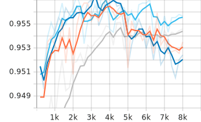
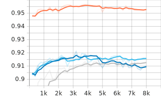
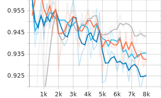
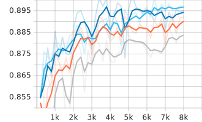

[Main Page](../../README.md)

# Dialog Dataset

[TR] [Qi Jia ve diğerleri](https://github.com/JiaQiSJTU/QAmatching) tarafından yayınlanan bir makale için hazırlanan verisetidir. Çince doktor-hasta diyalog kayıtlarını içeren veriseti [Google Translate API](https://cloud.google.com/translate) yardımıyla Türkçeye çevrilerek kullanılmıştır.

[EN]

# Fine Tuning Metrics

Model         | Phase       | Accuracy    |  Precision   | Recall        | F1
:-------------|:------------|:-----------:|:------------:|:-------------:|:-------:|
BERTurk       | Train/Eval  | 0.957015    |  0.951456    | 0.885542      | <b>0.956515
          | Test        | 0.961081    |  0.950317    | 0.902610      | 0.925849
DistilBERTurk | Train/Eval  | 0.957556    |  0.947705    | 0.891566      | 0.918779
          | Test        | 0.962432    |  0.952481    | 0.905622      | 0.928461
ConvBERTurk   | Train/Eval  | <b>0.958773 |  0.951311    | 0.892570      | 0.921005
          | Test        | <b>0.963243 |  0.956475    | 0.904618      | <b>0.929824
ELECTRA Base  | Train/Eval  | 0.955123    |  0.953057    | 0.876506      | 0.913180
          | Test        | 0.958378    |  0.942226    | 0.900602      | 0.920944

 
 

# Fine Tuning Metrics by Step

BERTurk -~- 
DistilBERTurk -~- 
ConvBERTurk -~- 
ELECTRA Base

Accuracy                   |  F1
:-------------------------:|:-------------------------:
  |  

Precision                  |  Recall
:-------------------------:|:-------------------------:
  |  