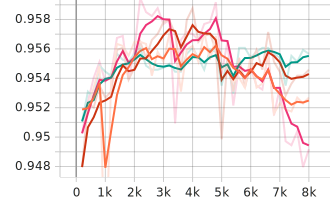
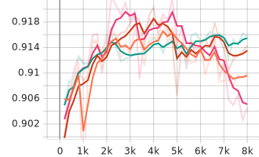
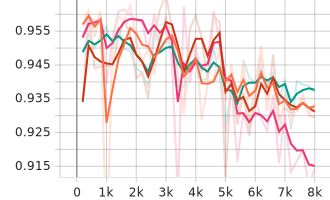
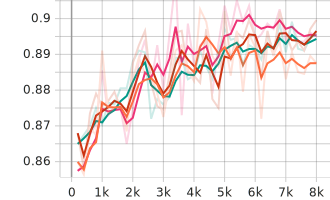

[Main Page](../../README.md)

# Quora Dataset

[TR] Bu veriseti iki farklı kaynaktan beslenmiştir. Birincisi [Quora](https://www.kaggle.com/competitions/quora-question-pairs/submit) tarafından bir yarışma için yayınlanan verisetidir. [Google Translate API](https://cloud.google.com/translate) ile Türkçeye çevrilmiş (ilk 8000 adedi) ve kayıtlar soru olarak etiketlenmiştir. İkincisi ise negatif örnek olması açısından Wikipedia'dan alınıp temizlenen [cümle verisetidir](https://www.kaggle.com/datasets/ahmetax/hury-dataset). Soru değil şeklinde etiketlenerek verisetine dahil edilmiştir.

[EN]

# Fine Tuning Metrics

Model         | Phase       | Accuracy    |  Precision   | Recall        | F1
:-------------|:------------|:-----------:|:------------:|:-------------:|:-------:|
BERTurk       | Train/Eval  | 0.957151    |  0.939171    | 0.899096      | 0.918697
          | Test        | <b>0.994758 |  0.998883    | 0.991140      | <b>0.994997
DistilBERTurk | Train/Eval  | 0.956100    |  0.956400    | 0.899100      | 0.916100
          | Test        | 0.980198    |  0.997709    | 0.964562      | 0.980855
ConvBERTurk   | Train/Eval  | 0.958773    |  0.959673    | 0.884036      | 0.920303
          | Test        | 0.983110    |  0.997722    | 0.970099      | 0.983717
ELECTRA Base  | Train/Eval  | <b>0.959178 |  0.952355    | 0.893072      | <b>0.921762
          | Test        | 0.980198    |  0.997709    | 0.964562      | 0.980855

 
 

# Fine Tuning Metrics by Step

 BERTurk
-~- 
 DistilBERTurk
-~- 
 ConvBERTurk
-~- 
  ELECTRA Base

Accuracy                   |  F1
:-------------------------:|:-------------------------:
   |  

Precision                  |  Recall
:-------------------------:|:-------------------------:
  |  