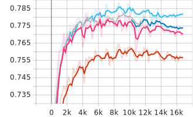
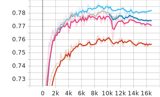
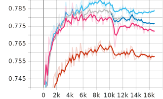

[Main Page](../../README.md)

# Tweet Dataset

[TR] [Özger ve diğerleri](https://www.researchgate.net/publication/269270054_Question_identification_on_Turkish_tweets) tarafından Türkçe tweetler toplanıp etiketlenerek oluşturulan verisetidir. Tweetler soru şekline göre ayrıştırılmış ve elle etiketlenmiştir. Veriseti için [Zeynep Banu Özger](https://akademik.ksu.edu.tr/Default.aspx?kod=RPiLQi1MpsC/kKBGpozQCS2FGrgd3NQFollrxZSvQkI=) ile iletişime geçiniz.

[EN] 

# Fine Tuning Metrics

Model         | Phase       | Accuracy    |  Precision   | Recall        | F1
:-------------|:------------|:-----------:|:------------:|:-------------:|:-------:|
BERTurk       | Train/Eval  | 0.782134    |  0.781457    | 0.782134      | 0.780599
          | Test        | 0.781042    |  0.782017    | 0.781042      | 0.781219
DistilBERTurk | Train/Eval  | 0.764300    |  0.766500    | 0.764300      | 0.762900
          | Test        | 0.760239    |  0.761716    | 0.760239      | 0.760213
ConvBERTurk   | Train/Eval  | 0.783800    |  0.786000    | 0.782000      | 0.781900
          | Test        | <b>0.782082 |  0.784239    | 0.782082      | <b>0.782424
ELECTRA Base  | Train/Eval  | <b>0.788375 |  0.790655    | 0.788375      | <b>0.787725
          | Test        | 0.781302    |  0.783859    | 0.781302      | 0.781766

 
 

# Fine Tuning Metrics by Step

 BERTurk
-~- 
 DistilBERTurk
-~- 
 ConvBERTurk
-~- 
 ELECTRA Base

Accuracy                   |  F1
:-------------------------:|:-------------------------:
  |  

Precision                  |  Recall
:-------------------------:|:-------------------------:
  |  